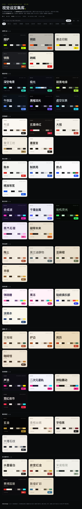
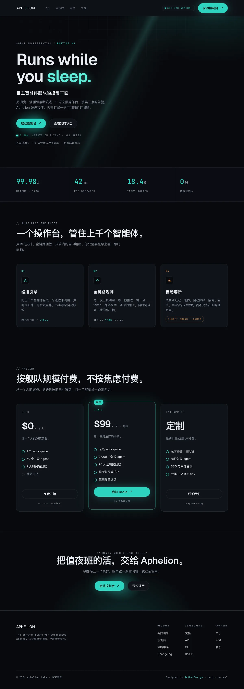
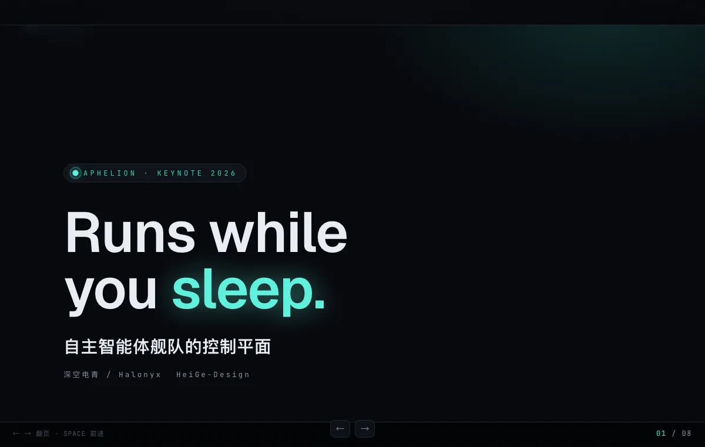
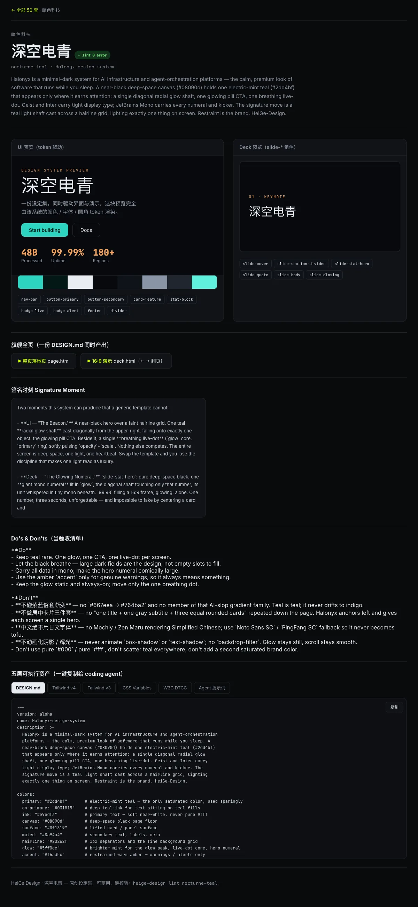

# HeiGe·Design

给 AI 一张视觉角色卡。50 套原创品牌设定集，一份 `DESIGN.md` 同时驱动界面和演示。



## 示例（这一份设定集能干什么）

拿暗色科技家族的 `nocturne-teal`（深空电青）当例子。同一份 `DESIGN.md`，同时长出一张落地页和一套演示，签名时刻都是那道斜射的电青辉光轴。

| 一份 DESIGN.md → 落地页 | 一份 DESIGN.md → 16:9 演示 |
|---|---|
|  |  |

每套都有一个详情页：token 驱动预览、调色板、组件、Do/Don't 验收清单、五格式一键复制、lint 徽章、旗舰全页入口。



从任意网站提取设计规范也是一条命令。示例 `ingested/stripe-demo/` 就是 `heige-design ingest https://stripe.com` 的产物，纯 CSSOM 提取出主色 `#533afd`，不依赖任何付费 API。

> 说明：仓库内 50 套里 `nocturne-teal / noir-vermilion / forge-anvil / moxi-void / boing-candy / onyx-gold` 六套带手工旗舰全页当质量标杆，其余 44 套是 token 驱动预览，随时可用 `heige-design build <slug>` 生成整页。

## 它是什么

AI 写代码越来越稳，做界面却常有一股默认模板味：紫蓝渐变、圆角大卡片、字体间距都像从空气里摸出来的。问题在于它没有稳定的设计上下文。

`DESIGN.md` 就是给 coding agent 的视觉角色卡：颜色、字体、间距、圆角、组件是骨架，品牌气质和 Do-Don't 是性格。HeiGe·Design 把这件事做成一个工具：50 套原创设定集 + 一整套 ingest / export / lint / diff / build 能力。

它从 **HeiGe-UI 界面锻造** 和 **HeiGe-PPT 演讲锻造** 共用的那层视觉基因演化而来。所以它有一个别人没有的能力：一份设定集同时产出网页界面和 16:9 演示。

## 四个别人没有的地方

1. **UI + 演示融合**：同一份 DESIGN.md 的 components 里同时有界面组件和 `slide-*` 演示组件，一份设定集驱动落地页和 PPT。生态里的工具只产网页 token。
2. **自含式 URL 提取**：`ingest` 用 playwright 本地读 CSSOM 提取设计规范，不依赖任何付费 API。同类工具全绑在 Context.dev 上。
3. **原创可商用**：50 套全是原创虚构品牌，不逆向任何真实公司，规避商标风险。
4. **反 AI 味内建**：每套都过反 AI 体检和字体兜底 / 零孤字 / 性能三条生产铁律，不是裸 token。

## 能力

| 能力 | 命令 |
|---|---|
| 浏览与搜索 50 套（家族 / 颜色 / 明暗 / 关键词） | 打开 `site/index.html` |
| 五层可执行资产导出（Tailwind v4/v3 · CSS 变量 · W3C DTCG · agent 提示词） | `heige-design export <slug> --format ...` |
| 校验（结构 + WCAG 对比度，官方 lint） | `heige-design lint <slug\|all>` |
| 对比两套差异 | `heige-design diff <A> <B>` |
| 从任意网站提取 DESIGN.md 草稿 | `heige-design ingest <url>` |
| 打印可直接粘给 coding agent 的生成提示词 | `heige-design build <slug>` |
| 一份设定集产出整页落地页 + 16:9 deck | 见 `systems/<slug>/flagship/` |

## 50 套 · 11 家族

凶悍工业 · 暗色科技 · 优雅编辑 · 瑞士纪律 · 复古未来 · 有机自然 · 玩味玩具 · 温暖人文 · 张扬极繁 · 奢侈高定 · **东方新中式**。

最后一个家族是差异化护城河：水墨留白 / 故宫红金 / 宋瓷极简 / 赛博国潮 / 敦煌矿彩，西方设计库里没有的东方美学系统，全部原创。完整配方见 `references/aesthetic-atlas.md`。

## 快速上手

```bash
# 列出全部或某家族
node bin/heige-design list
node bin/heige-design list 暗色科技

# 按某套风格生成一版界面（最常用）
node bin/heige-design build nocturne-teal   # 打印提示词，粘给 Claude Code / Cursor / Codex

# 导出 token 接进项目
node bin/heige-design export nocturne-teal --format tailwind-v4

# 从一个你喜欢的网站提取草稿
node bin/heige-design ingest https://example.com

# 校验 / 重建站点
node bin/heige-design lint all
node bin/heige-design site
```

配 Claude Code / Codex 时，把 `SKILL.md` 放进 skills 目录，agent 会自己按上面的工作流调用。

## 目录

```
systems/<slug>/
  DESIGN.md         设定集（YAML tokens + Markdown 理由 + UI/PPT 融合层）
  exports/          五层可执行资产
  flagship/         整页落地页 + 16:9 deck（部分套）
site/               画廊 + 50 个详情页
bin/heige-design    统一 CLI
references/         气质图谱 / 格式规范 / 反AI清单 / 生产铁律 / 能力矩阵 / 回写环路
scripts/            导出 / 校验 / 提取 / 站点生成
```

## 生产铁律

字体加载失败也不崩（中文栈带系统兜底，中文不用日文字体），任何屏宽都不出孤字，滚动起来不掉帧（不动画化阴影、不用 backdrop-filter）。这三条是交付门槛，不是加分项。

## 兼容

DESIGN.md 兼容 Google Labs `design.md` 标准，`npx @google/design.md lint` 全过。可 `export` 到 Tailwind v4/v3 和 W3C Design Tokens。

署名 HeiGe · MIT · 无致谢。基于 HeiGe-UI / HeiGe-PPT 演化而来。
